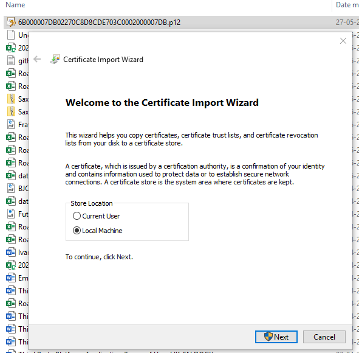
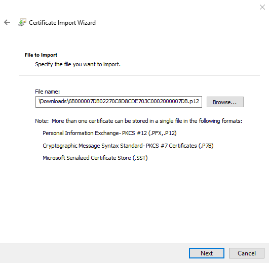

# Certificate-Based Authentication Sample
This example shows how certificate-based authentication can be implemented.

>Certificate-based authentication is only available for certain institutional clients, upon request!

A description of this flow is provided here: [Certificate-Based Authentication guide](https://developer.saxobank.com/openapi/learn/oauth-certificate-based-authentication).

The sample application is a simple .NET Core console application.

To get it running you need two pieces of information:
* Settings for the application configuration.
* A UserId and corresponding certificate for the user to be authenticated.

## Getting the application configuration settings
Applications that can perform certificate-based authentication can only be created by Saxo Bank.

You will receive the following information

|Name|Description|Example|
|-----|-----------|-------|
|AppUrl|A string identifying your application. Most often a Url|https://localhost/mycbapplication|
|AppKey|The application key. Equivalent of the OAuth client_id parameter| 3ca59dd3a9b0408bad62bb0c7b42xxxx|
|AppSecret|The application secret. Equivalent of the OAuth client_secret|962d5c529166401db837e9c5c4cxxxxx|

## Getting a user certificate
You must also have login credentials for the user to be authenticated. Furthermore, this user must have been configured to be able to download a certificate, representing this user.

Saxo Bank will inform you, once the user has been configured for certificate management.

At that point you must follow the procedure described here to download a certificate [Managing Certificates in MyAccount] (https://developer.saxobank.com/openapi/learn/managing-certificates-in-myaccount).

## Installing the certificate
You now need to install the certificate on the machine. Double-click on the certificate file.

Select the certificate.

Enter the password obtained when the certificate was downloaded.

Select a certificate store.

Complete the import

## Verify that the certificate is installed correctly
After installation, you can check if the certificate is available in the Certificate Manager of the Local Computer.

## Update Application Settings with the values provided
Application settings go into the App.json file.
Note the values for "TokenEndPoint" and "OpenApiBaseUrl" are set to point to the simulation environment.

Settings for the certificate is placed in the Certificate.json file.

## Run the application
The application is now fully configured. But because the application must retrieve the certificate from the certificate store, you might need to run Visual Studio with administrator privileges (depending on the version).

Make sure Visual Studio is run as administrator (see below). If not, exit Visual Studio and restart it with "Run as administrator".

### Now press F5.
You should now see the application automatically log in, retrieve an access token and return client data.

