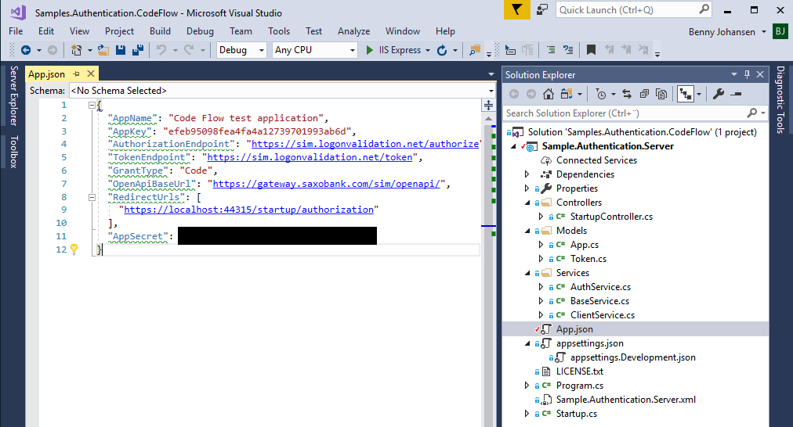

# OAuth 2 Code Flow Sample
This sample demonstrates how to implement the OAuth 2 Code Flow.

A description of this flow is provided here: [OAuth2 Code Flow example](https://www.developer.saxobank.com/openapi/learn/oauth-authorization-code-grant).

The sample application is a simple .NET Core service. It runs on https://localhost:44315 and it expects to receive the OAuth callback at https://localhost:44315/startup/authorization.

You can create a valid set of application credentials from the developer portal as shown below:

## First log in, and navigate to the Apps section:
Make sure you fill in the redirect url correctly and select the Code grant type. 

Determine if you would like the app to be able to trade, accept the disclaimer and press CREATE APPLICATION.

## Then grap the application configuration
You can now fetch the AppKey and AppSecret individually. 

Alternatively, you may press the 'Copy App Object' button in the upper right corner to transfer the complete set of application configuration values to the clipboard.

## Insert the application configuration
Open the App.json file in the VisualStudio solution and paste in the application object copied in the previous step.

## Finally run the application
Press F5 to run the application.

You will be prompted to log in.

You may initially be shown a disclaimer.

Once the login and disclaimer step is completed, you will be shown values for the current access token as well as information about the client to which the authenticated user is related.

