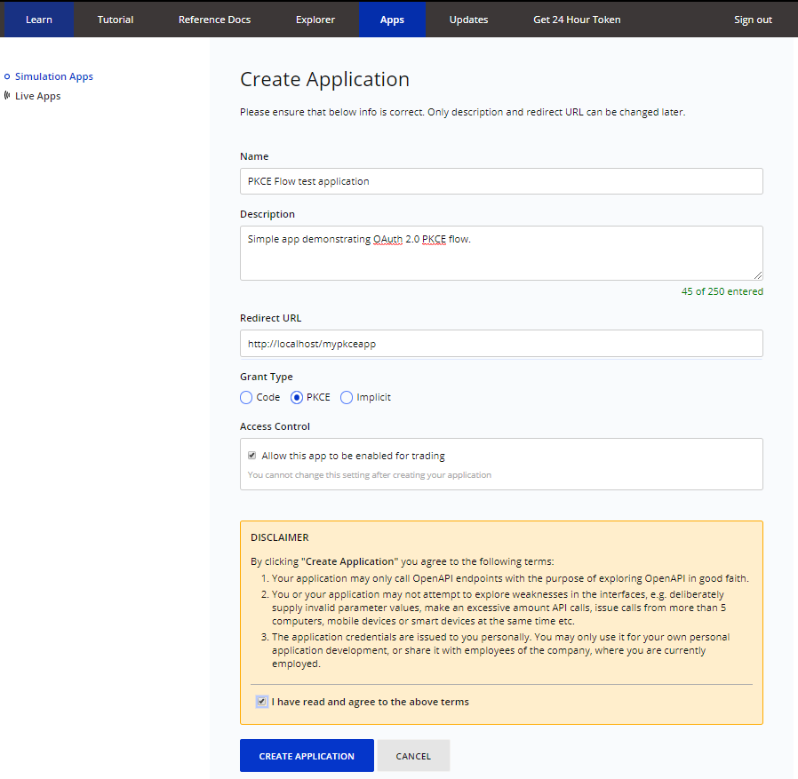
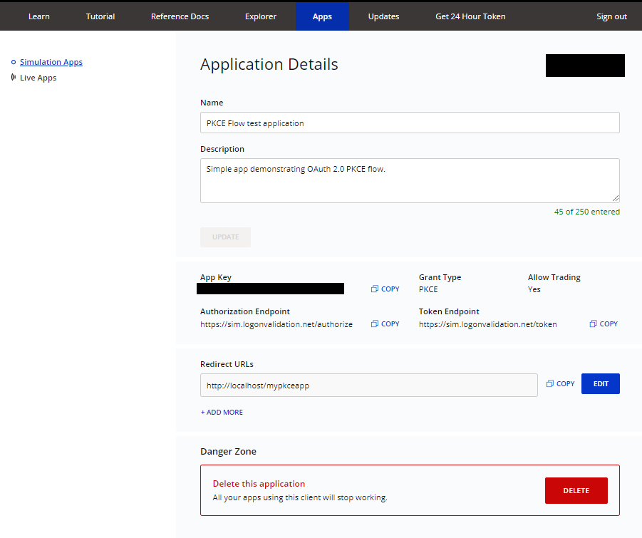
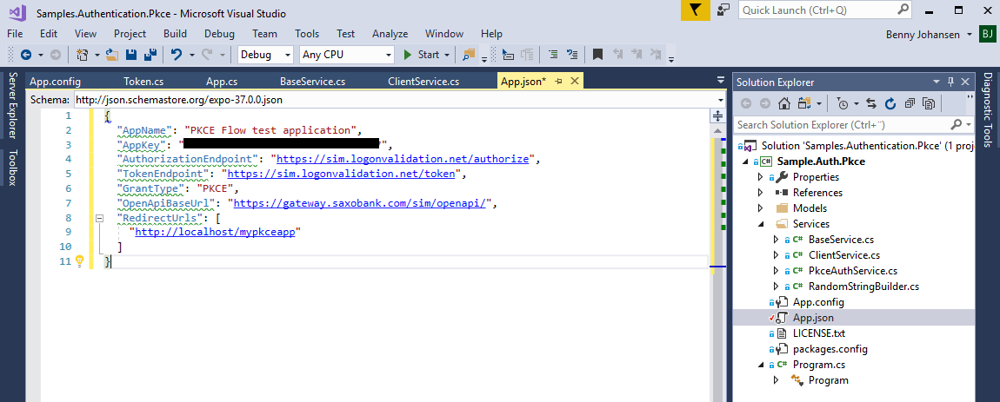
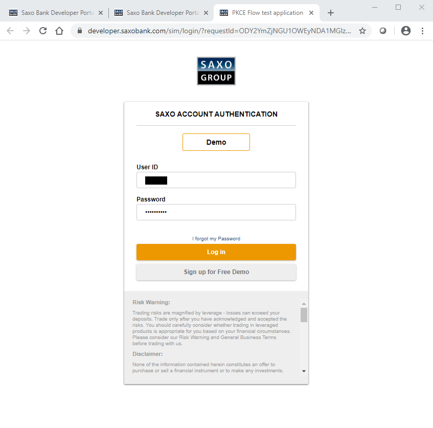
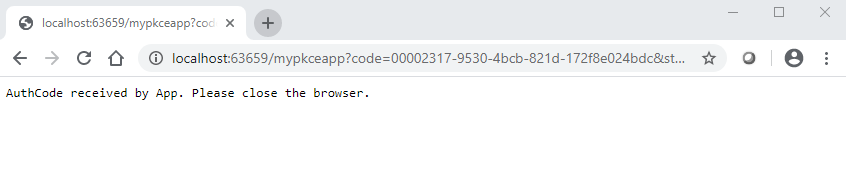
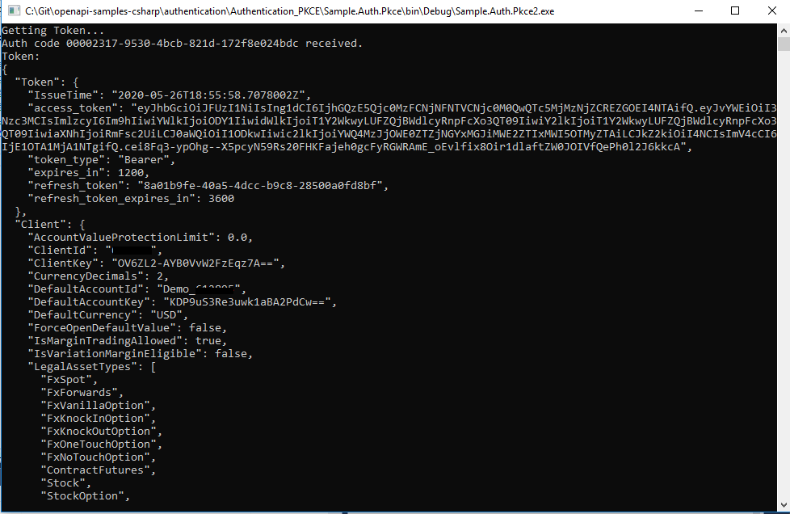

# OAuth 2 PKCE Flow Sample
This sample demonstrates how to implement the OAuth 2 PKCE Flow.

A description of this flow is provided here: [OAuth2 PKCE Flow guide](https://developer.saxobank.com/openapi/learn/oauth-authorization-code-grant-pkce).

The sample application is a simple .NET Framework console application.

You can create a valid set of application credentials from the developer portal as shown below.

## First log in, and navigate to the Apps section:

You are free to specify any redirect url as long as it resolves to localhost and does not include a port number. The sample code will read this from the configuration object (see next step).

Determine if you would like the app to be able to trade, accept the disclaimer and press CREATE APPLICATION.

## Then grap the application configuration
You can now fetch the AppKey for use in the application. 

Alternatively, you may press the 'Copy App Object' button in the upper right corner to transfer the complete set of application configuration values to the clipboard.

## Insert the application configuration
Open the App.json file in the VisualStudio solution and paste in the application object copied in the previous step.

## Finally run the application
Press F5 to run the application.

You will be prompted to log in.

You may initially be shown a disclaimer.

Authorization is now complete, and the browser is kept open, showing an information for the user to manually close it.
.

At the same time the console application will proceed, and you will be shown values for the current access token as well as information about the client to which the authenticated user is related.

